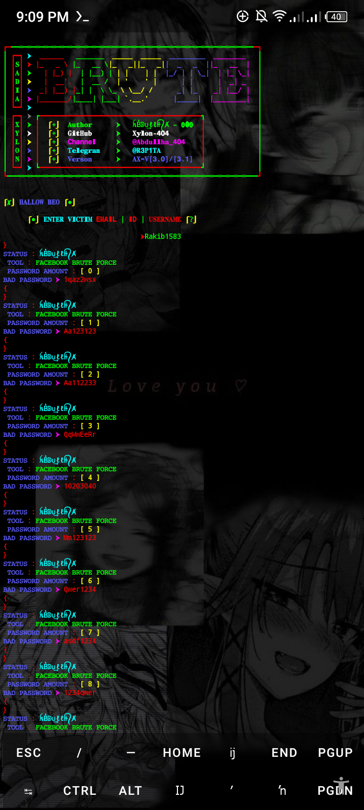

#### FB-BRUTE-FORCE🔥

<p align="center">

#### Language > </br>

 </td>
    <td align="center" width="96">
      <a href="#macropower-tech">
        
      </a>
      <br>Python

## Requirements - 
- Stable Internet Connection
- 400+ MB Storage
- Termux Version Upto Date
- Android 7 or higher
- Required modules in requirements.txt
- No Root
- No Termux Knowlegde
- ⚡Bruteforce attack on Facebook account using 5 Million password list,This tools are use only educational purposes ⚡

 <p align="center">
</p>

#### INSTALL TOOL ON TERMUX

#### TOOL 1 STYLISH VERY DANGER
```python
rm -rf FB-BRUTE-FORCE
git clone https://github.com/Xylon-404/FB-BRUTE-FORCE.git
cd FB-BRUTE-FORCE
python  ƑB͛-ß𝚁ᵁ̽†𒈸.py
```

#### USERNAME 


#### Password 


